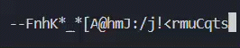
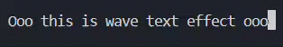
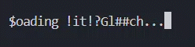

# Textfx Examples

This file contains detailed usage examples for all available Textfx effects and loader classes.

---

## 1. Typing Effect (`typeeffect`)

```python
from textfx import typeeffect

# Basic typing
typeeffect("Hello, world!", delay=0.1)

# With color
typeeffect("Colored typing...", color="cyan", delay=0.05)
```

---

## 2. Scramble Effect (`scrameffect`)

```python
from textfx import scrameffect

# Scramble to real text
scrameffect("Scrambled Text", delay=0.1)

# With color and faster speed
scrameffect("Fast & Green", color="green", delay=0.03)
```

---

## 3. Wave Text (`wavetext`)

```python
from textfx import wavetext

# Basic wave pattern
wavetext("Wave Text Demo", delay=0.1)

# Colored wave
wavetext("Rainbow Waves", color="magenta", delay=0.08)
```

---

## 4. Untyping Effect (`untypeeffect`)

```python
from textfx import untypeeffect

# Erase character by character
untypeeffect("Erasing this line...", delay=0.1)
```

---

## 5. Unscramble Effect (`unscrameffect`)

```python
from textfx import unscrameffect

# Glitch into nothing
unscrameffect("Glitching Away", delay=0.1)
```

---

## 6. Unwave Text (`unwavetext`)

```python
from textfx import unwavetext

# Start wavy then settle
unwavetext("Settling Waves", delay=0.1)
```

---

## 7. Loading Animations

All loader classes use `with` context manager.

### 7.1 SpinnerLoading

```python
import time
from textfx import SpinnerLoading

with SpinnerLoading(
    message="Processing...",
    animation="⠋⠙⠸⠴⠦⠇",
    delay=0.1
):
    time.sleep(3)
```

### 7.2 ProgressBarLoading

```python
import time
from textfx import ProgressBarLoading

with ProgressBarLoading(
    barline="-", animation="█", length=30,
    message="Loading", delay=0.05
):
    time.sleep(4)
```

### 7.3 GlitchLoading

```python
import time
from textfx import GlitchLoading

with GlitchLoading(
    text="Decrypting...",
    delay=0.1
):
    time.sleep(5)
```

---

## 8. Color Examples


```python
from textfx import typeeffect, scrameffect

typeeffect("This is red text!", color="red", delay=0.1)
scrameffect("Yellow scramble", color="yellow", delay=0.1)
```
---


## 9. Loading Examples with Loading Animation


```python
from textfx import SpinnerLoading, ProgressBarLoading, GlitchLoading
from time import sleep

with SpinnerLoading(message="Loading ", animation="⠋⠙⠸⠴⠦⠇", message_color="red", animation_color="blue", delay=0.1):
    sleep(5)

with ProgressBarLoading(message="Loading", barline='-', animation='#', length=20, message_color="yellow", animation_color=None, barline_color="green", delay=0.1):
    sleep(4)

with GlitchLoading(message="Loading...", delay=0.1, charset="#$%&*@!?", color="blue"):
    sleep(3)

with ProgressBarLoading(message="Compiling Code", barline=".", animation="⚙", length=40, message_color="cyan", animation_color="yellow", barline_color="white", delay=0.07):
    time.sleep(5)


```
---

Enjoy experimenting with Textfx!
